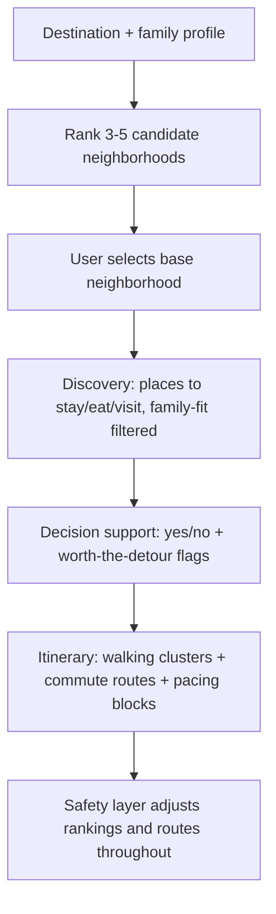

# Experience Curation Engine (Single-Family-First)

## Summary

A single-family travel planning app that curates where to stay, eat, and visit for a destination through a neighborhood-first funnel, then sequences a day-by-day itinerary around walking-distance clusters, commute routes, and family pacing. A safety layer steers neighborhood ranking and routing away from areas flagged as unsafe for tourists. Multi-family coordination and trip booking (flights, hotels) are deferred to later phases.

## Problem Frame

Today, planning a family trip means stitching together search-engine results, travel blogs, and social media (Instagram/TikTok/YouTube) into a workable plan by hand — there's no single tool that filters places by family-fit (dietary needs, accessibility, pacing, age-appropriateness), groups them geographically, and turns the result into a day-by-day schedule. The gap is sharpest for families with young kids, where nap/rest/bedtime windows constrain what a day can actually hold, and where "is this neighborhood worth basing ourselves in" can't be answered without already knowing what's nearby. The test case for this build is a spring Tokyo trip for 2 adults and kids ages 4 and 7.

## Key Decisions

- **Neighborhood-first funnel.** The app anchors on "where should we base ourselves" before discovery, decision support, or itinerary-building — those all happen within the chosen area. This matches the stated planning order (neighborhood → discovery/curation → decision support → itinerary/pacing).

- **Generic-first neighborhood ranking.** v1 ranks candidate neighborhoods by general family-friendliness (vs. business/nightlife districts), not by the specific family's profile. The family's ages, pacing, and dietary needs shape what's surfaced once an area is chosen, not which areas get ranked.

- **Region-appropriate, destination-aware sourcing.** Discovery data blends established review platforms chosen per destination (e.g., Tabelog for restaurants in Japan) with social media, blog, and video trend scanning — not a single hardcoded global API (e.g., Google Places). v1 ships with one destination, but the sourcing approach must support swapping in different platforms per destination.

- **Safety signals from reputable sources.** Unsafe-area flags come from official travel advisories and reputable crime-data sources, not crowdsourced "avoid this neighborhood" tags, to avoid encoding biased narratives about areas. These flags feed both neighborhood ranking and route planning.

- **Single family, single destination for v1.** Multi-family coordination (shared decisions, cost-splitting, cross-family tracks) and additional destinations are out of scope for this build, though the sourcing decision above keeps the door open for more destinations later.

## Key Flows

- F1. **Neighborhood selection.** User provides a destination and family profile (composition, ages). The app ranks 3-5 candidate neighborhoods by general family-friendliness, each with a "day in the life" preview (highlight places, safety notes, a sample walking-distance bundle of food + activities). The user picks one as their base.

- F2. **Discovery & curation.** Within the chosen neighborhood, the app surfaces places to stay, eat, and visit, filtered by family-fit criteria (dietary needs, accessibility, age-appropriateness, pacing), sourced from region-appropriate review platforms plus social/web/video trend scanning.

- F3. **Decision support.** For each candidate place or activity, the user marks yes/no for inclusion. Highly-rated places outside the neighborhood's walking-distance radius are flagged "worth the detour" rather than excluded.

- F4. **Itinerary building.** The app sequences "yes" items into day-by-day plans: walking-distance items cluster into the same segment, detour items get their commute/transit route scheduled alongside them, and pacing blocks (naps, rest, bedtime) are reserved as fixed slots that other activities are arranged around.

- F5. **Safety-aware adjustments.** Throughout F1-F4, areas flagged unsafe for tourists are deprioritized in rankings and discovery, and flagged when a computed route would pass through them.

## Requirements

**Neighborhood Discovery**

- R1. The app ranks 3-5 candidate neighborhoods/areas for the chosen destination by general family-friendliness.
- R2. Each neighborhood profile includes a "day in the life" preview: highlight places, safety notes, and a sample walking-distance bundle of food and activities.
- R3. The user selects a single neighborhood as their base for the trip.

**Discovery & Curation**

- R4. The app surfaces places to stay, eat, and visit within or near the selected neighborhood, filtered by family-fit criteria (dietary needs, accessibility, age-appropriateness, pacing).
- R5. Source data blends region-appropriate established review platforms, selected per destination, with social media, blog, and video trend scanning.
- R6. v1 ships with a curated dataset for one destination (Tokyo); the sourcing approach does not assume a single global data source, so additional destinations can be added without redesigning discovery.

**Decision Support**

- R7. For each candidate place or activity, the user can mark a yes/no decision on whether to include it in the itinerary.
- R8. Highly-rated places outside the selected neighborhood's walking-distance radius are flagged "worth the detour" rather than excluded.

**Itinerary Building**

- R9. The itinerary groups walking-distance-clustered places into the same day/segment by default.
- R10. "Worth the detour" places can be included in a day's plan with the commute/transit route to and from them factored into that day's schedule.
- R11. The itinerary sequences each day's activities and routes around fixed pacing blocks (naps, rest, bedtime) defined in the family profile.
- R12. The itinerary computes and displays commute/transit routes between consecutive stops.

**Safety**

- R13. Areas considered unsafe for tourists are deprioritized in neighborhood ranking and discovery results, and flagged in route planning when a computed route passes through them.
- R14. Safety signals come from official travel advisories and reputable crime-data sources, not crowdsourced "avoid this area" tags.

## Acceptance Examples

- AE1. **Covers R1, R3.** Given a spring Tokyo trip for 2 adults and kids ages 4 and 7, when the user opens neighborhood discovery, then the app shows 3-5 candidate areas ranked by general family-friendliness, each with a day-in-the-life preview, and the user selects one as their base.

- AE2. **Covers R8, R10.** Given the user has selected a base neighborhood, when a restaurant outside the walking-distance radius has a high rating/review count, then it appears in discovery flagged "worth the detour"; if the user marks it yes, the itinerary includes the commute route to and from it on the day it's scheduled.

- AE3. **Covers R11.** Given a family profile with a 4-year-old's nap window (e.g., 1-3pm), when the itinerary sequences a day's activities, then no activity is scheduled during that window and surrounding activities are arranged around it.

- AE4. **Covers R13.** Given an area flagged unsafe for tourists, when that area appears in neighborhood rankings or as part of a computed route, then it is deprioritized or flagged rather than silently included.

## Success Criteria

- A user planning the Tokyo test trip can go from destination + family profile to a day-by-day itinerary with routes and pacing blocks without needing to separately consult blogs or social media for the core places to stay, eat, and visit.

## Scope Boundaries

**Deferred for later (v2+)**

- Multi-family coordination: shared decision-making, cost-splitting, cross-family itinerary tracks.
- Flight/airfare search and booking.
- Hotel/lodging booking and price comparison — v1 curates *where* to stay, not the booking flow.
- Additional destinations beyond the v1 Tokyo test case (R6 keeps this from requiring a redesign).

**Outside this product's identity**

- General-purpose (non-family) trip planning.
- Post-trip itinerary/document tracking (TripIt-style booking organizer).

## Dependencies / Assumptions

- Assumes access to region-appropriate review-platform data (e.g., Tabelog-style sources for Japan) and social/web/video content for trend signal; specific integrations are a planning concern.
- Assumes a family profile capturing composition, ages, dietary needs, accessibility needs, and pacing constraints (nap/rest/bedtime windows) exists or is built as part of this work.
- Assumes "worth the detour" and yes/no tour-inclusion use a simple default heuristic for v1 (e.g., a rating/review-count threshold for detour-worthiness, and a default-yes suggestion for in-cluster items that pass family-fit filters, with user override) — exact thresholds are left to planning.

## Outstanding Questions

**Deferred to Planning**

- Exact thresholds for "worth the detour" (rating/review-count cutoffs) and whether yes/no tour-inclusion needs recommendation logic beyond a default-yes suggestion for in-cluster items.
- Whether the discovery/curation layer (R4-R6) and the route/detour logic (R8, R10, R12) build on an existing tool like Wanderlust GOAT (see Sources / Research) versus a custom pipeline.

## Sources / Research

- Ideation run (`/tmp/compound-engineering/ce-ideate/6b214a00/`) produced 7 survivors across 5 axes; this brainstorm combines survivors #1 (Family-Fit Constraint Layer), #2 (Multigen Pacing & Split-and-Rejoin Orchestration), and #7 (Single-Family Mode as Real MVP).
- Named market gap from that research: no existing product (Wanderlog, GoWhee, AvoSquado, Troupe, etc.) unifies family-fit filtering with pacing-aware, geography-clustered itineraries.
- printingpress.dev/library/travel — a library of agent-native CLIs covering flight/hotel booking platforms and local-exploration tools; a candidate source for v2 booking integrations.
- printingpress.dev/library/travel/wanderlust-goat — a CLI that already does much of what R4-R6, R8, R10, and R12 describe: a two-stage discovery funnel (seed from Google Places, validate against locale-aware sources like Tabelog, Naver, Le Fooding, Atlas Obscura, Reddit, Wikivoyage, OSM), persona-driven filtering, walking-route analysis with "interesting stops along the way" (`route-view`), and cross-source pairing of restaurants with nearby attractions (`crossover`) using OSRM for routing. Strong candidate building block for planning to evaluate before building discovery/routing from scratch.
