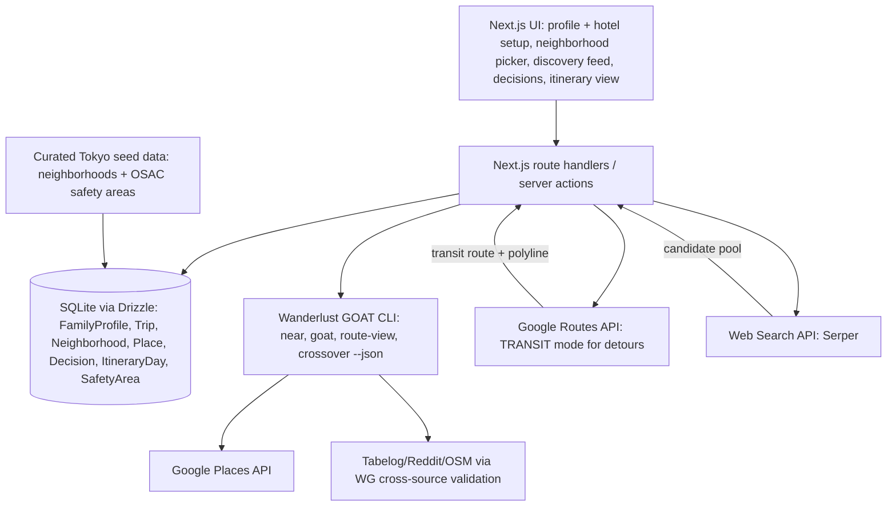
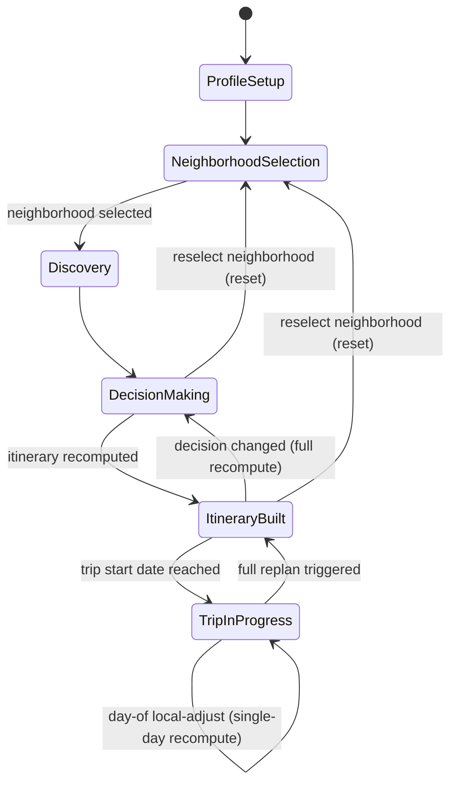
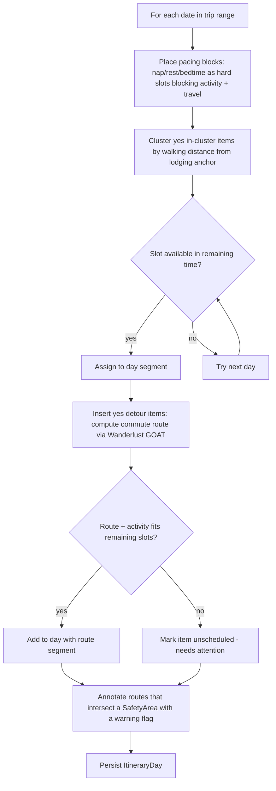

# feat: Experience Curation Engine — Single-Family Tokyo MVP

## Summary

A Next.js + TypeScript web app that takes a family profile, a pre-booked hotel address, and a Tokyo trip and produces a day-by-day itinerary: rank candidate neighborhoods to inform where to book, discover and filter places to eat and visit within the chosen area (using a three-layer pipeline — web search for candidate breadth, Google Places for structured enrichment, Wanderlust GOAT for cross-source trust validation and corroboration scoring), let the user mark yes/no per place (with "worth the detour" flags for standout places outside walking distance, with multi-modal routing via Google Routes API), and sequence the result into a pacing-aware schedule. The itinerary supports on-the-fly day-of adjustments — skip a stop, defer to tomorrow, shift a pacing block — without triggering a full trip replan. A safety layer sourced from official advisories runs throughout.

## Problem Frame

Today, planning a family trip means manually combining search results, blogs, and social media into a workable plan — there's no tool that filters places by family-fit, groups them geographically, and turns the result into a schedule built around nap/rest/bedtime windows. This plan builds the single-family v1 of that tool, scoped to one destination (Tokyo) and one family (2 adults, kids ages 4 and 7), per the origin brainstorm (see origin: docs/brainstorms/2026-06-15-experience-curation-engine-requirements.md).

---

## Requirements

**Neighborhood discovery**

- R1. The app ranks 3-5 candidate neighborhoods/areas for the chosen destination by general family-friendliness.
- R2. Each neighborhood profile includes a "day in the life" preview: highlight places, safety notes, and a sample walking-distance bundle of food and activities.
- R3. The user selects a single neighborhood as their base for the trip.
- R3a. The user provides their pre-booked accommodation (hotel name + address) at trip setup; this anchors the day-by-day itinerary. Neighborhood selection (R3) serves as a pre-booking decision aid when the user hasn't yet booked; if a hotel address is provided, the app resolves the neighborhood automatically from it.

**Discovery & curation**

- R4. The app surfaces places to eat and visit within or near the selected neighborhood, filtered by family-fit criteria (dietary needs, accessibility, age-appropriateness, pacing). Accommodation is not curated — the user provides their pre-booked hotel at trip setup (see R3a).
- R5. Source data blends region-appropriate established review platforms, selected per destination, with social media, blog, and video trend scanning.
- R6. v1 ships with a curated dataset for one destination (Tokyo); the sourcing approach does not assume a single global data source. Adding a new destination requires only: (a) a new `src/data/{city}/` directory with `neighborhoods.json` and `safety-areas.json`, (b) a `Destination` seed record with city-specific config (locale validators, walking radius norm, safety data source), and (c) no changes to service code — all service logic is parameterized by `destinationId`.

**Decision support**

- R7. For each candidate place or activity, the user can mark a yes/no decision on whether to include it in the itinerary.
- R8. Highly-rated places outside the selected neighborhood's walking-distance radius are flagged "worth the detour" rather than excluded.

**Itinerary building**

- R9. The itinerary groups walking-distance-clustered places into the same day/segment by default.
- R10. "Worth the detour" places can be included in a day's plan with the commute/transit route to and from them factored into that day's schedule.
- R11. The itinerary sequences each day's activities and routes around fixed pacing blocks (naps, rest, bedtime) defined in the family profile.
- R12. The itinerary computes and displays commute/transit routes between consecutive stops.
- R15. The user can make day-of adjustments to the current day's schedule — skipping a stop, deferring it to the next available day, or shifting a pacing block by a given amount — without triggering a full-trip replan.

**Safety**

- R13. Areas considered unsafe for tourists are deprioritized in neighborhood ranking and discovery results, and flagged in route planning when a computed route passes through them.
- R14. Safety signals come from official travel advisories and reputable crime-data sources, not crowdsourced "avoid this area" tags.

---

## Key Technical Decisions

- **KTD-A: Stack.** Next.js (App Router) + TypeScript in strict mode, with Drizzle ORM over SQLite for v1 persistence. Rationale: the flows describe a stateful, multi-step session a family returns to (profile → neighborhood → discovery → decisions → itinerary), which needs a persisted "trip" entity; SQLite keeps v1 infra-free for a single-family scope. Drizzle's schema is portable to Postgres later, but the actual migration trigger is horizontal scaling — multiple app instances writing concurrently — not JSON-column query limitations (SQLite and Postgres both support JSON); SQLite's single-writer lock is a non-issue at v1's single-persistent-process, single-family scope (see KTD-J).

- **KTD-J: Deployment topology — single persistent process.** v1 runs as a single long-lived containerized process (e.g., Fly.io/Render/a VM), not serverless functions. Two other decisions already assume this without stating it: SQLite (KTD-A) needs a persistent, writable filesystem across requests, and the Wanderlust GOAT subprocess (KTD-B) benefits from a long-lived process that can hold a warm result cache (`src/services/wanderlust-goat/cache.ts`, U5) rather than re-paying binary startup cost on every serverless cold start. Naming this once resolves the deployment ambiguity in both places. **Docker build strategy:** the WG binary is compiled from Go source via the npx installer — there is no pre-built release binary. The Dockerfile uses a two-stage build: a `golang:1.26-alpine` stage installs Node and runs `npx -y @mvanhorn/printing-press-library install wanderlust-goat --cli-only` to compile the binary, then copies it to `/usr/local/bin/` in the final `node:22-alpine` stage. The WG data cache (`~/.local/share/wanderlust-goat-pp-cli/data.db`) and config (`~/.config/wanderlust-goat-pp-cli/config.toml`) paths must be writable in the running container — a named volume or `RUN mkdir -p` in the Dockerfile suffices for v1. **`sync-city` must run at container startup** (not build time, since it requires `GOOGLE_PLACES_API_KEY` at runtime) via an entrypoint script: `wanderlust-goat-pp-cli sync-city "Tokyo" --country JP` before the Next.js server starts. Without this, `route-view` and `crossover` return null results and `goat` falls back to English-only sources.

- **KTD-B: Wanderlust GOAT as cross-source validation layer and split routing strategy.** Wanderlust GOAT (Go, Apache 2.0, CLI with `--agent` output mode and an MCP server variant) serves two roles: (1) cross-source trust validation for all discovery candidates — web search results, Google Places results, and WG's own `goat` output are passed through WG's Tabelog/Naver/Reddit/Wikivoyage/OSM cross-referencing to compute a per-place corroboration score (KTD-C); (2) walking-cluster routing — `route-view`/`crossover` compute routes between in-neighborhood stops (walking mode, via OSM data — OSRM is handled internally by WG, not a separate dependency). **Detour routing is handled separately by Google Routes API (KTD-I)**, not by WG, because WG's routing primitives are walking-only. F1 (neighborhood ranking), F3 (decision state), pacing scheduling, and the F5 safety layer have no equivalent in Wanderlust GOAT and are built as app-layer logic. The app calls WG as a subprocess using the `--agent` flag (sets `--json --no-input --no-color --yes`) with explicit `--select <fields>` to retrieve full field data rather than the compact subset; exact field names are pending a live `goat --json` run (see Open Questions). Nominatim (`nominatim.openstreetmap.org`) is the geocoding backend — public OSM instance, no self-hosting required. U9's safety-route-flagging for walking segments uses `route-view`/`crossover` geometry; detour route safety-flagging uses the geometry from Google Routes API (KTD-I).

- **KTD-I: Multi-modal detour routing via Google Routes API.** "Worth the detour" places outside the walking-distance radius require transit routing. The Google Routes API (`routes.googleapis.com/directions/v2:computeRoutes`) with `travelMode: TRANSIT` is the v1 choice — it shares the existing Google Cloud project and billing with Google Places (KTD-A), requires no additional API key, and has comprehensive coverage of Tokyo's subway, JR, Toei, and bus networks. The routing result includes mode, line names, duration, and step-level geometry, enabling: (a) display of "22 min via Marunouchi Line + 5 min walk" alongside the detour badge; (b) safety-area route-intersection checks (U9) using the returned polyline. Other modes (driving/taxi, cycling) are supported by the same API and can be added as user-selectable options in a follow-up; v1 shows transit as the default for detours, with walking as the fallback if no transit route exists.

- **KTD-C: Three-layer Tokyo discovery pipeline (R5, R6).** Discovery runs in three sequential stages:

  1. **Web search (candidate breadth).** A search API (Serper or Brave Search, see Open Questions) queries for trending family-friendly places in each category per neighborhood — e.g., "best family ramen Kichijoji 2025." This surfaces candidates from blogs, articles, and editorial content that haven't yet accumulated enough Google Places reviews to appear via the structured API. Web search output is treated as a *candidate pool only*, not a trust signal — individual blog posts are assumed potentially sponsored and carry no inherent quality weight on their own.

  2. **Google Places (structured enrichment).** Every candidate — from web search or from WG's own `near`/`goat` output — is enriched with structured data from Google Places: `placeId`, rating, review count, geometry. Google's API policy permits indefinite storage only of `place_id`; rating, review count, name, and location are subject to caching limits (location capped at 30 days). The `Place` table (U1) treats `placeId` as the durable key and treats rating/review-count/location as refresh-on-demand fields per KTD-E.

  3. **WG cross-source validation (trust filter).** All candidates are run through Wanderlust GOAT's cross-referencing against Tabelog, Naver, Reddit, Wikivoyage, and OSM to produce a per-place `corroborationScore`: the count of independent sources that positively mention the place. A blog post that fails WG validation (no Tabelog rating, no Reddit mentions, no OSM presence) scores 0 and surfaces at the bottom of discovery. A place corroborated by 3+ independent sources is highly likely to be genuinely good — paid reviews rarely coordinate across Tabelog (a native Japanese community with its own anti-gaming mechanisms), Reddit, and OSM simultaneously. Tabelog has no public API; its signal arrives only via WG's existing scraping-based validation, accepted for v1 with the fragility noted in Risks.

- **KTD-D: Safety data sourcing (R13, R14).** The SafetyArea seed is a curated allowlist sourced from OSAC's Japan Crime & Safety Report (state-affiliated), naming specific Tokyo districts (e.g., Roppongi and Kabuki-cho for assault/drink-spiking/theft risk, Ikebukuro for similar entertainment-district risk, Akasaka/Harajuku for pickpocketing), each entry citing its OSAC source line. Programmatic Tokyo crime-data APIs were checked during planning and found unverifiable against an official source — not used (see Risks, Open Questions).

- **KTD-E: "Worth the detour" and yes/no defaults (resolves origin's deferred question on thresholds).** A place outside the selected neighborhood's walking-distance radius is flagged "worth the detour" when `rating >= 4.5` and `review_count >= 500` (Google-Places-scale defaults, stored as destination-tunable constants), or when it appears among Wanderlust GOAT's trending/social signals. Places outside the radius that don't meet this bar are excluded from discovery entirely rather than shown unflagged. In-cluster items that pass family-fit filtering default to yes; "worth the detour" items default to no, requiring explicit opt-in given the added commute burden for families with young kids. Per KTD-C, the threshold is evaluated against rating/review-count fetched at discovery time (U6), not against values persisted from an earlier session.

- **KTD-F: Itinerary state model — two-mode recompute strategy.** Pacing blocks (nap/rest/bedtime) are hard constraints that block both activity placement and travel/commute time across the whole day timeline.

  **Pre-trip planning mode (full recompute).** Any change to the family profile, decisions, or selected neighborhood triggers a full recompute of the entire itinerary from scratch. These changes are infrequent and the user expects to wait; simplicity of implementation justifies the cost.

  **Day-of local-adjust mode (single-day scope).** Once a trip is `TripInProgress` (U7 state), the user can make quick adjustments to the current day without recomputing the whole trip: skip a stop (remove from today, mark `skipped`), defer to tomorrow (move to the first available slot on the next day, or `unscheduled-today` if none), swap two consecutive stops, or shift today's pacing block by a given duration (e.g., "nap ran 45 min late"). Local adjustments recompute only the affected day's remaining slot sequence — other days are untouched. Today's pacing shift is a one-day override; the trip-wide default is unchanged. Per-day pacing configuration in advance (e.g., a later bedtime preset for a travel day) remains deferred.

  An item that cannot be placed during full recompute is marked "unscheduled — needs attention" rather than silently dropped.

- **KTD-K: Itinerary segment data model — normalized table over JSON array.** `ItineraryDay` segments are stored as a separate `ItinerarySegment` table (`id`, `dayId`, `order`, `segmentType` [`place` | `pacing-block` | `route`], `placeId` nullable, `adjustmentState`, `startTime`/`endTime`, `payload` JSON for type-specific data such as route polyline or a place snapshot) rather than a single JSON column on `ItineraryDay`. Local-adjust actions (KTD-F's `skipItem`/`deferItem`/`swapItems`/`shiftPacingBlock`) need to address, reorder, and query individual segments by state — a JSON blob would make every mutation a full read-modify-write of the day's entire segment array, and U10's "needs attention" list (segments where `adjustmentState = unscheduled-today`) would require deserializing every day's JSON rather than an indexed query. `order` is a sortable string/fractional value, not a dense integer index, so `swapItems` and `deferItem` can insert a segment between two existing ones without renumbering the rest of the day.

- **KTD-G: Neighborhood reselection resets downstream state (resolves the F1↔F3 backtrack question).** Choosing a different base neighborhood clears discovery results, decisions, and the itinerary for that trip. This matches R3's framing of a single base and avoids building cross-neighborhood state migration for v1.

- **KTD-H: Lodging anchor from pre-booked accommodation.** The user enters their booked hotel (name + address) during trip setup (U2, R3a); this address is geocoded to a lat/lng and stored on the `Trip` record as `lodgingAnchor`. The app does not curate or recommend accommodation — discovery covers eat and visit categories only (R4). The `lodgingAnchor` anchors each day's start/end point for walking-distance clustering (U8) and is the origin/destination for all detour commute routes (U9). If the user has not yet booked and leaves the field blank, U8 falls back to the selected neighborhood centroid as a proxy anchor, with a visible banner indicating itinerary accuracy improves once a hotel address is provided. The single-stay-decision enforcement previously needed in U7 is removed — the anchor is always set at trip setup, not via the decisions phase. Route safety flagging is unchanged: a computed route that intersects a SafetyArea entry is annotated with a warning but still scheduled (AE4).

- **KTD-L: Hotel address geocoding via Google Places Find Place from Text.** Resolving the user-entered hotel name + address (U2, R3a) into a lat/lng reuses the existing Google Places client (already integrated for KTD-A/U5/U6) via the "Find Place from Text" endpoint, rather than adding a dedicated Geocoding API as a third Google Maps Platform product to enable and bill. Find Place from Text is also the better semantic fit — it resolves a *named place* (a hotel), not just a raw address string. If no match is found (typo, non-standard hotel name formatting), U2 surfaces an explicit "couldn't locate this address" error rather than silently saving `lodgingAnchor: null`, which would otherwise be indistinguishable from the user intentionally leaving the field blank (KTD-H's centroid-fallback case).

---

## High-Level Technical Design

**System architecture.** The Next.js app owns persistence and orchestration; Wanderlust GOAT runs as a sibling CLI process invoked with `--json`; the curated Tokyo seed data (neighborhoods + safety areas) loads into the same database at setup time.



**Trip lifecycle.** The trip moves through five states; reselecting the neighborhood (KTD-G) resets back to neighborhood selection from either decision-making or itinerary-built.



**Itinerary scheduling algorithm (U8/U9, directional).** Pacing blocks are placed first as hard slots; in-cluster "yes" items are clustered by walking distance around the lodging anchor; "worth the detour" items are inserted where a route fits; anything that doesn't fit anywhere is marked unscheduled rather than dropped.



---

## Output Structure

```
src/
  app/
    layout.tsx
    page.tsx
    profile/page.tsx
    trip/[tripId]/
      neighborhoods/page.tsx
      discovery/page.tsx
      decisions/page.tsx
      itinerary/page.tsx
    api/
      profile/route.ts
      trips/route.ts
      neighborhoods/route.ts
      discovery/route.ts
      decisions/route.ts
      itinerary/route.ts
  db/
    schema.ts
    client.ts
    migrations/
    seed.ts
    seed.test.ts
  services/
    wanderlust-goat/
      client.ts
      types.ts
      cache.ts
      fixtures/
        goat-kichijoji.json
        route-view-sample.json
        crossover-sample.json
    neighborhoods/
      ranking.ts
    discovery/
      filters.ts
      web-search.ts
      web-search.test.ts
    itinerary/
      scheduler.ts
      routing.ts
    safety/
      areas.ts
  data/
    _template/
      destination.json
      neighborhoods.json
      safety-areas.json
      RESEARCH_GUIDE.md
    tokyo/
      destination.json
      neighborhoods.json
      safety-areas.json
e2e/
  itinerary-recompute.spec.ts
Dockerfile
scripts/
  entrypoint.sh
playwright.config.ts
.env.example
```

---

## Implementation Units

Units are grouped into five phases: **Foundation** (U1-U2), **Neighborhood Layer** (U3-U4, F1/F5), **Discovery Layer** (U5-U6, F2), **Decision & Itinerary Engine** (U7-U9, F3/F4/F5), and **Itinerary Presentation** (U10).

### U1. Project scaffolding and data model

- **Goal:** Stand up the Next.js + TypeScript (strict) project with Drizzle ORM over SQLite, and define the core schema: `FamilyProfile`, `Trip`, `Neighborhood`, `Place`, `Decision`, `ItineraryDay`, `ItinerarySegment`, `SafetyArea`.
- **Requirements:** Foundation for R1-R15 (no single R-ID; all downstream units depend on this schema). R6's destination extensibility is enforced here — the `Destination` table is the contract that makes adding a city a data operation, not a code change.
- **Dependencies:** None.
- **Files:** `src/db/schema.ts`, `src/db/client.ts`, `src/db/migrations/`, `package.json`, `tsconfig.json`, `src/app/layout.tsx`.
- **Approach:** Define tables with foreign keys reflecting the lifecycle in the High-Level Technical Design.

  `Destination` is the extensibility anchor (R6): `id`, `slug` (e.g., `tokyo`, `paris`, `seoul`), `name`, `country`, `defaultWalkingRadiusMeters`, `localeValidators` (JSON array — WG cross-source validators appropriate for this city, e.g., `["tabelog", "reddit", "osm"]` for Tokyo, `["le-fooding", "reddit", "osm"]` for Paris), `safetyDataSource` (citation string for the SafetyArea seed). This table is seeded per destination; adding a new city = adding one row here plus its data directory. Service code reads `localeValidators` from this record at runtime — no city-specific logic is hardcoded in service files.

  `Trip` references one `FamilyProfile` and one `Destination` (not a hardcoded string), and (nullably, until selected) one `Neighborhood`. Changing `Trip.destinationId` to a proper FK now means the trip-creation UI can support any seeded destination in v2 with no schema migration. Also carries `lodgingAnchor` (nullable lat/lng + formatted address) per KTD-H.

  `Neighborhood` and `SafetyArea` are both scoped to a `Destination` via FK — this is what makes neighborhood ranking and safety flagging destination-aware without hardcoding city names in query logic.

  `Place` references `Neighborhood` and stores Google's `placeId` as its durable external key, with rating/review-count/location treated as refresh-on-demand fields per KTD-C; also carries a `sources` JSON array (values: `web-search`, `google-places`, `wanderlust-goat`) and a `corroborationScore` integer used for discovery ranking in U6.

  `Decision` joins `Trip` and `Place` with a `category` field (`eat`/`visit`). Stay is no longer a decision category (KTD-H).

  `ItineraryDay` references `Trip` and holds day-level metadata (date). `ItinerarySegment` references `ItineraryDay` and holds the ordered, addressable segment rows: `order` (sortable string), `segmentType` (`place` | `pacing-block` | `route`), `placeId` (nullable), `adjustmentState` (`scheduled`, `skipped`, `deferred`, `unscheduled-today`), `startTime`/`endTime`, and a `payload` JSON column for type-specific data (route polyline, place snapshot) — per KTD-K and KTD-F.

  `SafetyArea` is scoped to a `Destination` and referenced by ranking (U4) and route flagging (U9).
- **Test scenarios:**
  - Happy path: running migrations creates all nine tables (`Destination` and `ItinerarySegment` plus the original seven) with expected columns and foreign keys.
  - Integration: inserting an `ItinerarySegment` between two existing segments (a fractional/sortable `order` value) does not require updating the `order` of any other segment in the day (KTD-K).
  - Happy path: a second `Destination` row (e.g., `paris`) can be inserted without any schema change — confirms the extensibility contract of R6.
  - Edge case: inserting a `Decision` for a `Place` not linked to the trip's selected `Neighborhood` is allowed (detour items live outside the neighborhood) — schema must not over-constrain this.
  - Integration: deleting a `Trip` cascades to its `Decision` and `ItineraryDay` rows (or is blocked, per chosen FK policy — pick one and test it).
- **Verification:** Migrations apply cleanly from empty; a seed script can insert and retrieve one row per table.

### U2. Family profile and trip setup

- **Goal:** UI and route handlers for creating a family profile (composition, kid ages, dietary/accessibility needs, trip-wide pacing windows) and a trip (destination, date range, pre-booked hotel address) linked to that profile.
- **Requirements:** Supports R11 (pacing windows live on the profile); foundational for the whole flow.
- **Dependencies:** U1.
- **Files:** `src/app/profile/page.tsx`, `src/app/api/profile/route.ts`, `src/app/api/trips/route.ts`, `src/services/profile/validation.ts`, `src/services/profile/validation.test.ts`, `src/services/trips/geocoding.ts`, `src/services/trips/geocoding.test.ts`.
- **Approach:** A single profile form captures adult/kid counts and ages, dietary/accessibility tags (free-text or small enum set), and pacing windows as named slots (e.g., `nap: 13:00-15:00`, `bedtime: 19:30-24:00`) applied to every day (KTD-F). Trip setup captures start/end date, destination (Tokyo only, v1), and an optional hotel address field (name + street address). If the hotel address is provided, it is resolved at save time via Google Places' Find Place from Text endpoint (KTD-L) and stored as `Trip.lodgingAnchor` (lat/lng + formatted address); if omitted, `lodgingAnchor` is null and U8 falls back to the selected neighborhood centroid per KTD-H. If Find Place from Text returns no match, trip setup surfaces an explicit "couldn't locate this address" error rather than silently saving a null anchor (KTD-L).
- **Test scenarios:**
  - Happy path: submitting a valid profile (2 adults, kids ages 4 and 7, nap 13:00-15:00, bedtime 19:30) persists and is retrievable.
  - Happy path: submitting a trip with a valid hotel address geocodes it and stores `lodgingAnchor` lat/lng on the `Trip` record.
  - Edge case: trip end date before start date is rejected with a validation error.
  - Edge case: overlapping pacing windows (e.g., nap 13:00-15:00 and a second window 14:00-16:00) are rejected or merged — pick one rule and enforce it, since U8 assumes non-overlapping pacing blocks.
  - Edge case: hotel address field omitted — trip saves with `lodgingAnchor: null`; downstream units receive null and apply the centroid fallback per KTD-H.
  - Error path: hotel address doesn't resolve via Find Place from Text (e.g., typo or non-standard formatting) — the user sees an explicit "couldn't locate this address" error and is prompted to retry, distinguishing this from intentionally leaving the field blank (KTD-L).
  - Error path: missing required fields (kid ages when kid count > 0) return a 400 with field-level errors.
- **Verification:** `validation.test.ts` and route-handler tests (mocked/in-memory SQLite via Drizzle) pass for profile create/validate and trip-date validation.

### U3. Tokyo neighborhood and safety seed data

- **Goal:** Establish the per-destination data contract (R6) and curate the v1 Tokyo dataset: a `destination.json` config, 5-8 candidate neighborhoods, and the SafetyArea allowlist. The seed script loads all of it into the database. Adding any future destination requires only adding a new `src/data/{city}/` directory matching this contract — no code changes.
- **Requirements:** R2, R6, R14.
- **Dependencies:** U1.
- **Files:** `src/data/_template/destination.json`, `src/data/_template/neighborhoods.json`, `src/data/_template/safety-areas.json`, `src/data/_template/RESEARCH_GUIDE.md`, `src/data/tokyo/destination.json`, `src/data/tokyo/neighborhoods.json`, `src/data/tokyo/safety-areas.json`, `src/db/seed.ts`, `src/db/seed.test.ts`.
- **Approach:**

  **Per-destination data contract** (`src/data/_template/` defines the shape; Tokyo is the first implementation):

  `destination.json` — one record per city: `slug`, `name`, `country`, `defaultWalkingRadiusMeters` (e.g., 1200 for Tokyo), `localeValidators` (WG Stage-2 validators to use — for Tokyo, `["tabelog","hotpepper"]`, the two non-stubbed Japan sources confirmed by `sync-city` output; `retty`, `notecom`, and `hatena` are stubbed in the current WG version and should be added when they become active. OSM and Reddit are geo-anchored sources handled by `sync-city`, not Stage-2 validators — the original plan value `["tabelog","reddit","osm"]` was wrong), `safetyDataSource` (citation for the SafetyArea entries).

  `neighborhoods.json` — array of neighborhood entries: `name`, `centroid` (lat/lng), `walkingRadiusMeters` (can override the destination default), `familyFriendlinessScore` (0-100, used by U4 ranking), `dayInTheLifePreview` (highlight places, safety note, sample food+activity bundle per R2), `sources` (array of URLs or publication names that informed this entry's score and preview — required, not optional).

  `safety-areas.json` — array of flagged districts: `name`, `geometry` (polygon or named place), `riskType` (e.g., `theft`, `assault`), `sourceQuote` (OSAC citation line per KTD-D).

  **Neighborhood scoring and preview: source-consensus pipeline, not manual curation.** `familyFriendlinessScore` and `dayInTheLifePreview` are derived from aggregated editorial signals across credible sources — not assigned by a single researcher's judgment. The pipeline is documented in `src/data/_template/RESEARCH_GUIDE.md` and re-run for each new destination. For Tokyo v1, the pipeline runs once and its output is committed as static seed data.

  **Source tiers and weighting:**
  - Tier 1 (weight 3): Established travel publications — Time Out Tokyo, Lonely Planet, Condé Nast Traveler
  - Tier 2 (weight 2): Japan/family-specific resources — Tokyo with Kids, Japan with Kids, Japan Times family content
  - Tier 3 (weight 1): Aggregated community consensus — Reddit r/JapanTravel family threads (surfaced via WG `reddit-quotes`), high-view YouTube family travel content

  **`familyFriendlinessScore` derivation:** For each neighborhood, count weighted source mentions recommending it for families (mention count × tier weight), then normalize to 0-100 relative to the highest-scoring neighborhood in the set. This produces a score that is relative and auditable — each entry's `sources` array records what informed it.

  **`dayInTheLifePreview` content:** Extract from consistent cross-source mentions — the highlight places are those named by 2+ independent sources, the safety note references KTD-D's flagged districts if relevant, and the food+activity bundle pairs the most-cited restaurant and activity within walking distance of the neighborhood centroid. Content is synthesized from sources with an LLM assist, then reviewed by a human for accuracy before committing.

  **Pipeline steps (documented in `RESEARCH_GUIDE.md` for repeatability):**
  1. Seed candidate neighborhoods from "best Tokyo neighborhoods for families" queries across Tier 1-2 sources using the web search API (Serper)
  2. For each candidate, run WG `reddit-quotes` to surface community consensus
  3. Aggregate weighted mention counts per neighborhood to derive `familyFriendlinessScore`
  4. Extract highlight places and food+activity pairs from cross-source mentions
  5. Human review pass: validate accuracy, confirm centroid coordinates, check SafetyArea overlap, adjust scores where source data is thin
  6. Commit finalized JSON to `src/data/tokyo/`

  **SafetyArea entries (manual, OSAC-sourced):** Roppongi, Kabuki-cho, Ikebukuro entertainment district, Akasaka/Harajuku pickpocketing callouts per the OSAC Japan report — these are not pipeline-derived, they come from the official advisory source only (KTD-D).

  The seed script discovers all `src/data/*/destination.json` files at runtime and loads them all — so the Tokyo seed and any future destination seeds are loaded by the same script without modification.
- **Test scenarios:**
  - Happy path: seed script discovers `src/data/tokyo/destination.json` automatically and populates one `Destination` row, 5-8 `Neighborhood` rows, and the SafetyArea allowlist without errors.
  - Happy path: adding a `src/data/paris/` directory with valid files and re-running the seed script loads Paris data alongside Tokyo with no code changes (R6 contract).
  - Edge case: every neighborhood entry has a non-empty `dayInTheLifePreview` and a non-empty `sources` array — seed validation fails loudly if either is missing, since R2 depends on both and auditability requires sources.
  - Edge case: no seeded neighborhood centroid falls inside a seeded SafetyArea polygon (sanity check — ranking candidates shouldn't already be flagged-unsafe districts).
  - Edge case: a `destination.json` missing a required field (e.g., `localeValidators`) causes the seed script to fail with a clear error identifying the file and missing field.
  - Edge case: all `familyFriendlinessScore` values in `neighborhoods.json` are distinct — no two neighborhoods share an identical score (ensures ranking produces a deterministic sort order).
- **Verification:** Seed script is idempotent (re-running doesn't duplicate rows); a manual review confirms each SafetyArea entry has an OSAC citation; each neighborhood entry's `sources` array contains at least one Tier 1 or Tier 2 source (not community-only); the `_template/` directory files are kept in sync with the `Destination` and `Neighborhood` schemas in U1.

### U4. Neighborhood ranking and selection

- **Goal:** Rank the seeded neighborhoods by family-friendliness with safety-aware deprioritization, show each with its "day in the life" preview, and let the user select one as the trip's base.
- **Requirements:** R1, R2, R3, R13 (ranking deprioritization); AE1.
- **Dependencies:** U2, U3.
- **Files:** `src/services/neighborhoods/ranking.ts`, `src/services/neighborhoods/ranking.test.ts`, `src/app/trip/[tripId]/neighborhoods/page.tsx`, `src/app/api/neighborhoods/route.ts`.
- **Approach:** Ranking score = base family-friendliness attribute from U3, reduced when a neighborhood is near (within its own walking radius of) a SafetyArea entry (R13). Sort descending, return top 3-5 (R1). Selecting a neighborhood writes `Trip.selectedNeighborhoodId` and applies KTD-G's reset (clear any existing `Decision`/`ItineraryDay` rows for the trip).
- **Test scenarios:**
  - Happy path: ranking returns 3-5 neighborhoods sorted by score, each with its "day in the life" preview attached. Covers AE1.
  - Edge case: a neighborhood whose radius overlaps a SafetyArea entry scores lower than an otherwise-identical neighborhood with no overlap.
  - Happy path: selecting a neighborhood persists `Trip.selectedNeighborhoodId`.
  - Integration: re-selecting a different neighborhood on a trip that already has decisions and an itinerary clears both (KTD-G) — verify the clear actually happens, not just that selection is overwritten.
- **Verification:** `ranking.test.ts` passes against a seeded in-memory SQLite database; the `api/neighborhoods` route-handler test confirms selection persists `Trip.selectedNeighborhoodId` and triggers the KTD-G reset.

### U5. Wanderlust GOAT integration service

- **Goal:** A server-side service module that wraps the Wanderlust GOAT CLI as a subprocess: invokes `near`/`goat` (discovery), `route-view`/`crossover` (routing/detour), parses `--json` output into typed results, caches results, and degrades gracefully if the binary is unavailable.
- **Requirements:** Infrastructure for R4, R5, R12 (no direct R-ID of its own).
- **Dependencies:** U1.
- **Files:** `src/services/wanderlust-goat/client.ts`, `src/services/wanderlust-goat/types.ts`, `src/services/wanderlust-goat/cache.ts`, `src/services/wanderlust-goat/client.test.ts`.
- **Approach:** A thin typed wrapper exposing: `discoverNear(neighborhoodName, radius, filters)`, `routeView(fromName, toName)`, `crossover(anchorName, radiusMeters, pair)`, each shelling out to the `wanderlust-goat-pp-cli` binary using the `--agent` flag with explicit `--select <fields>`. **Named anchor required** — raw lat/lng coordinates cause WG to fall back to `country: "*"` (English-only sources); a named string like `"Kichijoji, Tokyo, Japan"` resolves via Nominatim to `country: "JP"` and fires Japan-specific sources. U5 resolves each neighborhood centroid to a named anchor string before calling `goat` or `route-view`. The `goat` command is used for discovery (not `near`) — deterministic, no `ANTHROPIC_API_KEY` dependency.

  **Confirmed output schemas (live trial 2026-06-28):**
  - `goat --json`: `{ anchor: { query, lat, lng, country, display, city }, results: [{ name, lat, lng, address, walking_minutes, score: { total, google_base, locale_boost, notability_boost, reddit_boost, criteria_match }, sources, evidence, why, business_status, google_maps_uri }], trace: { Region, SeedCount, StageHits, StubsSkipped, Errors } }`
  - `route-view --json`: `{ from: { query, lat, lng, country, display, city }, to: { ... }, buffer_meters, distance_meters, walking_minutes, along_route, note }` — **no route polyline** in the confirmed output; `along_route` was null in the trial (requires populated local store via `sync-city`).
  - `crossover --json`: `{ anchor: { ... }, radius_meters, pair, pair_distance_meters, pairs, note }` — `pairs` was null in the trial (same `sync-city` dependency).

  Cache by `(command, anchorName, flags)` key. On startup check binary availability via `wanderlust-goat-pp-cli doctor`; if absent, surface "discovery/routing unavailable" — downstream units (U6, U9) must handle this. If WG is unavailable, U6 falls back to Google Places rating alone.
- **Patterns to follow:** Record the live trial JSON outputs as fixtures in `src/services/wanderlust-goat/fixtures/` and mock at the `client.ts` module boundary (not `child_process` directly) so U6/U9 tests run against canned data rather than the real binary.
- **Test scenarios:**
  - Happy path: given a sample JSON fixture for `near`, the wrapper returns correctly typed results.
  - Happy path: given a sample JSON fixture for `route-view`/`crossover`, the wrapper returns route segments with distance/duration and route geometry.
  - Error path: a non-zero exit code or malformed JSON from the subprocess is caught and surfaced as a typed error, not thrown raw.
  - Edge case: the binary is not installed/found on `PATH` — the service reports "unavailable" without crashing the calling code.
  - Integration: two identical queries within a session hit the cache on the second call (verify via call-count assertion on the subprocess invocation, not output equality).
- **Verification:** `client.test.ts` passes against recorded `--json` fixtures for `near`, `route-view`, and `crossover`, covering the malformed-output and binary-unavailable paths.

### U6. Discovery and family-fit filtering

- **Goal:** Run the three-layer discovery pipeline (KTD-C) for eat and visit categories in the selected neighborhood — web search for candidate breadth, Google Places for structured enrichment, Wanderlust GOAT for cross-source validation — then apply family-fit filters, rank by corroboration score, and apply safety deprioritization. Stay/accommodation is not a discovery category (R4, KTD-H).
- **Requirements:** R4, R5, R6, R13 (discovery deprioritization).
- **Dependencies:** U4, U5.
- **Files:** `src/services/discovery/filters.ts`, `src/services/discovery/filters.test.ts`, `src/services/discovery/web-search.ts`, `src/services/discovery/web-search.test.ts`, `src/app/api/discovery/route.ts`, `src/app/trip/[tripId]/discovery/page.tsx`.
- **Approach:** For the selected neighborhood, run KTD-C's three stages in sequence:
  1. **Web search candidates.** Call `web-search.ts` with category-specific queries per neighborhood (e.g., "family-friendly restaurants Kichijoji Tokyo 2025"). Extract candidate place names and addresses. These are combined with WG's `discoverNear` output into a single unscored candidate pool.
  2. **Google Places enrichment.** Match each candidate to a Google Places result by name/address to obtain `placeId`, rating, review count, and geometry, running these lookups concurrently under a bounded concurrency limit (e.g., 5-10 in flight) rather than sequentially — with roughly 10-15 candidates per category across eat/visit, sequential calls risk pushing discovery past a usable request latency. Unmatched candidates are dropped. Persist each matched result as a `Place` record with its `sources` array (U1).
  3. **WG cross-source validation.** Pass all `placeId`s through U5's `validateCandidates`, batched under the same bounded concurrency limit as step 2, to retrieve corroboration scores. Persist `corroborationScore` on each `Place` record. If WG is unavailable, proceed with null scores (Google Places rating becomes the sole rank signal).
  4. **Family-fit filtering and ranking.** Apply hard exclusions first, then rank survivors.

     **Hard exclusions (places removed from results entirely):**
     - Dietary: venues incompatible with the family profile's dietary tags
     - Accessibility: venues inaccessible per the profile's accessibility tags
     - Adult venue types: venues where Google Places `types` contains any of `bar`, `night_club`, `casino`, or `liquor_store` (constant list in `filters.ts`, easy to extend)
     - Late-night-only: venues where all opening hour windows start after the family's bedtime pacing block (derived from the family profile, not a hardcoded time)

     **Ranking signals (applied to survivors, descending priority):**
     1. `corroborationScore` (primary — cross-source trust from WG)
     2. Google Places `rating`
     3. Positive family signals: `goodForChildren: true` and/or `menuForChildren: true` boost rank when present; absence is neutral (Japan coverage is sparse — no penalty for missing)
     4. `priceLevel` — used as a soft deprioritization signal only, not a filter; higher price level reduces ranking position. No price level is hard-excluded since budget varies per family.
     5. Distance from centroid (tiebreaker)

     Places inside a SafetyArea are deprioritized (moved down in ordering, not excluded) per R13. If a category returns zero results after hard exclusions, widen the radius once; if still empty, surface an explicit empty state — hard exclusions must not silently relax.
- **Test scenarios:**
  - Happy path: results for a neighborhood include eat and visit places, each annotated with distance-from-centroid and corroboration score.
  - Happy path: a place surfaced only by web search with a corroboration score of 0 ranks below an otherwise-equal place corroborated by 3+ independent WG sources.
  - Happy path: a restaurant tagged incompatible with a profile's dietary need is excluded from results.
  - Happy path: a venue tagged not-accessible is excluded when the profile has an accessibility need.
  - Edge case: a venue with `types` containing `bar` is excluded regardless of rating or corroboration score.
  - Edge case: a venue whose only opening hours are 10pm–5am is excluded for a profile with a 7:30pm bedtime pacing block; a venue open 11am–11pm is not excluded by the same profile.
  - Edge case: a `priceLevel: 4` venue is not excluded — it appears in results but ranked below an otherwise-equal `priceLevel: 2` venue.
  - Happy path: a venue with `goodForChildren: true` ranks above an otherwise-equal venue where the field is absent.
  - Edge case: a venue where `goodForChildren` is absent is not penalized — its rank is the same as a venue with `goodForChildren: false`.
  - Edge case: a category with zero results after hard exclusions triggers one radius-widening retry, then an explicit empty state if still empty (no filter relaxation).
  - Edge case: WG unavailable — discovery still returns results ranked by Google Places rating and family signals alone; no corroboration scores present.
  - Integration: a place whose location falls inside a SafetyArea entry appears in results but ranked below otherwise-equal places outside flagged areas. Covers AE4 (discovery side).
- **Verification:** `filters.test.ts` passes with U5's client mocked via fixtures, asserting family-fit exclusions, the radius-widening retry, and SafetyArea-based ordering against a seeded in-memory database.

### U7. Decision support: yes/no and worth-the-detour

- **Goal:** For each discovered eat/visit place, compute the "worth the detour" flag (KTD-E) and a default yes/no, and let the user toggle the decision per place.
- **Requirements:** R7, R8; AE2.
- **Dependencies:** U6.
- **Files:** `src/services/discovery/detour.ts`, `src/services/discovery/detour.test.ts`, `src/app/api/decisions/route.ts`, `src/app/trip/[tripId]/decisions/page.tsx`.
- **Approach:** A place outside the neighborhood's walking radius is flagged "worth the detour" per KTD-E's thresholds (`rating >= 4.5 and review_count >= 500`, or appears in Wanderlust GOAT's trending signals); places outside the radius that don't meet this bar were already excluded by U6. Default decision: yes for in-cluster items that passed U6's filters, no for detour items. The UI lets the user flip any decision; each toggle persists a `Decision` row (trip, place, category, yes/no). Categories are `eat` and `visit` only — stay is not a decision category (KTD-H). The KTD-H single-stay-enforcement rule is removed; lodging anchor is set at trip setup.
- **Test scenarios:**
  - Happy path: an in-cluster item passing filters defaults to yes with no detour flag.
  - Happy path: an out-of-radius item meeting the rating/review threshold gets `worthTheDetour = true` and defaults to no. Covers AE2 (flagging side).
  - Edge case: toggling a decision from no to yes persists and is retrievable on reload.
  - Integration: reselecting the neighborhood (KTD-G, via U4) clears all `Decision` rows for the trip — verify decisions made under the old neighborhood don't leak into the new one.
- **Verification:** `detour.test.ts` passes against a seeded in-memory database, covering threshold flagging, the single-stay-anchor toggle rule, and the KTD-G reselect-reset.

### U8. Itinerary scheduling engine

- **Goal:** Two-mode scheduling engine (KTD-F). Full-recompute mode: for each date in the trip's range, place pacing blocks as hard slots, cluster "yes" in-cluster items by walking distance around the lodging anchor, and insert "yes" detour items where they fit, producing `ItineraryDay` and `ItinerarySegment` rows. Local-adjust mode: for the current in-progress day, apply a single user action (skip, defer, swap, or pacing-block shift) and recompute only that day's remaining slot sequence without touching other days. Pure scheduling logic; routing is U9.
- **Requirements:** R9, R11; AE3.
- **Dependencies:** U2 (pacing windows, trip dates, lodging anchor), U7 (decisions).
- **Files:** `src/services/itinerary/scheduler.ts`, `src/services/itinerary/scheduler.test.ts`.
- **Execution note:** This unit's core value is the scheduling algorithm in the High-Level Technical Design; implement it test-first against the scenarios below before wiring in U9's routing.
- **Technical design:** See the "Itinerary scheduling algorithm" flowchart in High-Level Technical Design — directional guidance for the placement order (pacing blocks → clustering → detour insertion → unscheduled fallback).
- **Approach:** Pacing blocks (from the family profile, applied to every day per KTD-F) are placed first and treated as walls the rest of the algorithm cannot schedule into — including the time a route to/from a stop would consume (KTD-F). The lodging anchor is read from `Trip.lodgingAnchor` (set at trip setup per KTD-H); if null, falls back to the selected neighborhood centroid with a visible warning. In-cluster "yes" items are grouped by proximity to the lodging anchor and distributed across the remaining slots per day. "Worth the detour" "yes" items are inserted into a day with enough remaining slot for the item plus its (to-be-computed-by-U9) commute time; for U8's own tests, mock route durations. An item with no feasible slot across the whole trip is marked `unscheduled` on its `ItinerarySegment` record (KTD-F, KTD-K) rather than dropped. The itinerary recomputes fully on any change to profile, decisions, or neighborhood (KTD-F) — this is pre-trip planning mode. In day-of local-adjust mode (trip state `TripInProgress`), only the affected day recomputes. Local-adjust actions: `skipItem(dayId, segmentId)` marks the segment `skipped` and closes the time gap; `deferItem(dayId, segmentId)` moves it to the first available slot on the next day if one exists, marks it `unscheduled-today` if the next day exists but has no available slot, or marks it permanent `unscheduled` if the current day is the last day of the trip (no future day to defer to); `swapItems(dayId, segmentId1, segmentId2)` exchanges two consecutive segments; `shiftPacingBlock(dayId, blockId, offsetMinutes)` adjusts today's pacing window by the given delta without touching the trip-wide default. **Full replan from `TripInProgress`:** the only path back to a full replan during an in-progress trip is the user explicitly navigating to the decisions view and toggling a yes/no — this transitions the trip from `TripInProgress` back to `ItineraryBuilt`, triggers a full recompute, and clears any local-adjust state for future days. Day-of local-adjust actions never trigger a full replan.
- **Test scenarios:**
  - Happy path: a nap window 13:00-15:00 blocks any activity from starting in that window. Covers AE3.
  - Edge case: an activity ending at 12:50 with a 15-minute walk to the next stop is not scheduled to start that walk before 13:00 — travel time also respects the pacing wall (KTD-F, sharpens AE3).
  - Happy path: in-cluster items near each other are assigned to the same day/segment.
  - Happy path: a detour item with a mocked 40-minute round-trip commute is placed on a day with a 40+ minute gap outside pacing blocks.
  - Edge case: a detour item that doesn't fit on any day (given mocked commute times) is marked `unscheduled` and still present in the output, not dropped.
  - Edge case: `Trip.lodgingAnchor` is null — the scheduler uses the neighborhood centroid as a fallback anchor and the itinerary view shows a banner prompting the user to add their hotel address.
  - Integration: a multi-day trip (e.g., 5 days) produces exactly one `ItineraryDay` per date in range.
  - Integration: flipping a decision from yes to no and recomputing removes that item from its day and reflows remaining items (KTD-F's "fully recomputed" rule).
  - Day-of: `skipItem` removes the segment from today's sequence and closes the time gap without changing other days.
  - Day-of: `deferItem` moves the item to the first available slot on the next day; if the next day has no available slot, marks it `unscheduled-today`.
  - Day-of: `deferItem` on the last day of the trip marks the item permanent `unscheduled` (no future day exists); it surfaces in the "needs attention" list rather than being silently dropped.
  - Day-of: `shiftPacingBlock` with +45 minutes moves today's nap window forward; the afternoon time slot opens earlier and subsequent items reflow — the trip-wide pacing default is unchanged. Covers AE5.
- **Verification:** `scheduler.test.ts` passes with mocked route durations, producing one `ItineraryDay` per trip date, correct `unscheduled` flags, the no-lodging-anchor precondition result, and all three local-adjust action types.

### U9. Commute routing and safety route flagging

- **Goal:** For consecutive stops within a day's segment, compute routes using the appropriate routing service per segment type — WG (`route-view`) for in-cluster walking legs, Google Routes API (TRANSIT mode) for detour legs — and annotate any route that intersects a SafetyArea entry with a warning, without blocking the schedule.
- **Requirements:** R12, R13 (route flagging); AE2, AE4.
- **Dependencies:** U5 (WG walking routes), U8, U3 (SafetyArea data); Google Routes API client (new, inline in this unit).
- **Files:** `src/services/itinerary/routing.ts`, `src/services/itinerary/routing.test.ts`.
- **Approach:** After U8 produces a day's stop sequence, for each consecutive stop pair: if both stops are within the walking-distance radius (in-cluster), compute the route via WG `route-view` (U5); if either stop is a "worth the detour" place (outside the radius), compute via Google Routes API with `travelMode: TRANSIT` (KTD-I). Attach distance, duration, and mode label (e.g., "Transit — 22 min via Marunouchi Line + 5 min walk") to the `ItinerarySegment`'s `payload` (KTD-K).

  **Safety route flagging — walking segments:** WG's `route-view` confirmed output does not include a route polyline (only `distance_meters` and `walking_minutes`). Walking-segment safety flagging therefore uses a **straight-line corridor check**: compute the straight line between the two stop coordinates and check whether it passes within a configurable buffer (e.g., 200m) of any `SafetyArea` centroid or polygon. This is an approximation — actual walking paths may deviate — but is sufficient for the coarse district-level safety data in KTD-D. Document the approximation in the UI warning text ("this route may pass near a flagged area").

  **Safety route flagging — detour segments:** Google Routes API returns step-level geometry (polyline per transit leg). Use the returned polyline for exact SafetyArea intersection checks on detour routes (KTD-I).

  If WG is unavailable for an in-cluster leg, fall back to a straight-line distance estimate with "route unavailable" label. If Google Routes API fails for a detour leg, show duration as "unavailable" but keep the stop in the schedule.
- **Test scenarios:**
  - Happy path: an in-cluster route between two nearby stops uses WG and returns distance, duration, and walking mode. Covers R12.
  - Happy path: a detour stop's commute uses Google Routes API and returns transit mode, line names, and duration. Covers AE2 (routing side) and R12 (multi-modal).
  - Happy path: the route polyline from Google Routes API is used to check SafetyArea intersection for detour legs.
  - Edge case: a route passing through a SafetyArea-flagged district gets a warning annotation but the segment remains scheduled. Covers AE4.
  - Edge case: a route with no SafetyArea intersection has no warning annotation.
  - Error path: WG unavailable for an in-cluster leg — segment shows "route unavailable" estimate; rest of the itinerary build completes.
  - Error path: Google Routes API unavailable for a detour leg — segment shows duration "unavailable"; stop remains scheduled.
- **Verification:** `routing.test.ts` passes with U5's client mocked via recorded `route-view`/`crossover` fixtures, covering the safety-flag intersection check and the routing-unavailable path.

### U10. Day-by-day itinerary view

- **Goal:** Render each `ItineraryDay`'s segments in order — places, pacing blocks, routes (with safety warnings), and detour markers — supporting two interaction modes: pre-trip (link back to decisions for yes/no changes, triggering full recompute) and day-of `TripInProgress` (inline quick actions on the current day's segments — skip, defer to tomorrow, swap with next, shift pacing block — triggering local-adjust recompute of today only per KTD-F).
- **Requirements:** R9-R12; AE1-AE4 (end-to-end presentation).
- **Dependencies:** U8, U9.
- **Files:** `src/app/trip/[tripId]/itinerary/page.tsx`, `src/app/api/itinerary/route.ts`.
- **Approach:** Render days in date order; within a day, render the sequence of pacing blocks and place segments with routes between consecutive places. Routes carrying a safety warning (U9) show a visible indicator. Places flagged "worth the detour" (U7) show a badge with their commute summary. An "unscheduled" item (U8/KTD-F) appears in a visible "needs attention" list rather than being silently absent.

  Pre-trip (states before `TripInProgress`): a link from each place back to the decisions view (U7) lets the user flip yes/no; flipping triggers a full recompute (U8/U9) and the itinerary view updates.

  Day-of (`TripInProgress`, current day only): each segment shows a contextual action menu — "Skip this stop" (local-adjust skip), "Do this tomorrow" (local-adjust defer), "Swap with next" (local-adjust swap). Pacing blocks show "Shift later / 30 min" and "Shift later / 1 hour." These actions call U8's local-adjust API and update the current day's view in place without reloading other days. Skipped and deferred items render visually distinct (muted with strikethrough) so the family can see what changed at a glance.
- **Test scenarios:**
  - Happy path: the itinerary view renders one section per day across the trip's date range, in order.
  - Happy path: pacing blocks render as distinct, non-activity slots within each day.
  - Edge case: a route carrying a safety warning (from U9) shows a visible warning indicator in the rendered segment.
  - Edge case: a "worth the detour" place shows its badge and commute summary.
  - Edge case: an `unscheduled` item appears in a "needs attention" list rather than being omitted.
  - Integration: toggling a decision from the itinerary view's link back to decisions (U7) triggers a full recompute and the itinerary view updates to reflect the new schedule.
  - Day-of: tapping "Skip this stop" in `TripInProgress` state calls the local-adjust skip action, removes the segment from the current day's display, and does not affect other days.
  - Day-of: tapping "Do this tomorrow" calls the local-adjust defer action; the item appears on tomorrow's view in its new slot, or in "needs attention" if no slot is available.
  - Day-of: tapping "Shift later / 45 min" on the nap block adjusts today's pacing block and reorders the current day's afternoon segments accordingly; the family profile pacing window is unchanged. Covers AE5.
- **Verification:** `api/itinerary` route-handler test passes against a seeded in-memory database; the decision-toggle-triggers-recompute flow is covered by a Playwright E2E test at `e2e/itinerary-recompute.spec.ts` (configured via `playwright.config.ts` at repo root), per Next.js's guidance that async Server Components/Server Actions need E2E rather than Vitest coverage.

---

## Scope Boundaries

**Deferred for later (v2+)** (carried from origin)

- Multi-family coordination: shared decision-making, cost-splitting, cross-family itinerary tracks.
- Flight/airfare search and booking.
- Hotel/lodging booking and price comparison — v1 asks the user to provide their pre-booked hotel address; v2 adds accommodation search and booking tooling, ideally with referral/affiliate credit from hotel vendors (e.g., Booking.com, Hotels.com partner programs).
- Additional destinations beyond the v1 Tokyo test case.

**Outside this product's identity** (carried from origin)

- General-purpose (non-family) trip planning.
- Post-trip itinerary/document tracking (TripIt-style booking organizer).

**Deferred to Follow-Up Work** (plan-local)

- MCP-based Wanderlust GOAT integration (KTD-B proposes CLI subprocess for v1; MCP is a credible alternative if the CLI proves limiting).
- Postgres migration (KTD-A's schema is designed to be portable, but the migration itself isn't part of this plan).
- Pre-planned per-day pacing overrides (KTD-F supports day-of real-time pacing shifts via local-adjust, but presetting a different window for a specific day in advance — e.g., a later bedtime on a known travel day — is deferred).
- A programmatic Tokyo crime-data feed, if the Tokyo Metropolitan Government's open data catalog independently verifies a usable source (KTD-D uses a curated OSAC allowlist for v1).
- Replacing U6's hand-built family-fit filters with Wanderlust GOAT's persona system, if U5's live trial (Open Questions) shows persona support for family/kid-age axes.
- Background-job/streaming discovery (status polling or SSE, U6) if bounded-concurrency parallel calls still exceed acceptable latency in practice — trigger: p95 discovery latency above ~5s.

---

## Acceptance Examples

(Carried from origin, with the resolving KTD noted where this plan sharpened the original wording.)

- AE1. Given a spring Tokyo trip for 2 adults and kids ages 4 and 7, when the user opens neighborhood discovery, then the app shows 3-5 candidate areas ranked by general family-friendliness, each with a day-in-the-life preview, and the user selects one as their base. (U4)
- AE2. Given the user has selected a base neighborhood, when a restaurant outside the walking-distance radius meets KTD-E's rating/review threshold, then it appears in discovery flagged "worth the detour"; if the user marks it yes, the itinerary includes the commute route to and from it on the day it's scheduled. (U7, U9)
- AE3. Given a family profile with a 4-year-old's nap window (e.g., 13:00-15:00), when the itinerary sequences a day's activities, then no activity *or travel time* is scheduled during that window (KTD-F sharpens "no activity" to include travel), and surrounding activities are arranged around it. (U8)
- AE4. Given an area flagged unsafe for tourists, when that area appears in neighborhood rankings or discovery, it is deprioritized (lower-ranked, not excluded); when it appears as part of a computed route, the route is flagged with a warning but still scheduled (KTD-H separates these two treatments). (U4, U6, U9)
- AE5. Given a family mid-trip whose 4-year-old's nap ran 45 minutes late, when the parent taps "Shift later / 45 min" on today's nap block, then today's afternoon schedule reflows around the updated nap window without changing tomorrow's plan or the trip-wide pacing default. (U8, U10)

---

## Risks & Dependencies

- **Cross-source validation produced 0 hits in live trial (KTD-C).** In the 2026-06-28 trial run, WG's `goat` call returned `locale_boost: 0` and `evidence: null` for all results — Tabelog scraping returned nothing and `HOTPEPPER_API_KEY` was unset. Without these two sources, the corroboration score is `0` for every discovered place, reducing WG's role to a Google Places wrapper with criteria matching. `HOTPEPPER_API_KEY` is now a near-required key (not optional) for Japan coverage to function. Tabelog scraping remains a ToS and availability risk with no mitigation beyond WG's internal implementation.
- **Wanderlust GOAT is an external Go binary (KTD-B).** Version drift or unavailability is a v1 dependency; U5 must detect absence and degrade gracefully rather than failing discovery/routing entirely. The binary is compiled from source at Docker build time (KTD-J) — a breaking change in the npm package or the upstream Go module would fail the build, not silently degrade at runtime.
- **`HOTPEPPER_API_KEY` is optional but improves Tokyo coverage.** Hotpepper (Recruit) is a major Japan restaurant platform. Without the key, WG falls back to HTML scraping of Hotpepper, which is fragile. Obtaining the key is low-effort and meaningfully strengthens the Japan-specific Stage-2 signal in KTD-C. Add to environment variable documentation alongside `GOOGLE_PLACES_API_KEY`.
- **Google Places API requires a billing-enabled Google Cloud project and API key as a setup prerequisite for U5/U6, and now also U2's hotel geocoding (KTD-L)**, independent of Wanderlust GOAT — this is a hard dependency even at zero/dev-scale usage, and the flat $200/month credit pool that previously covered most dev usage was removed in March 2025, so per-SKU free-tier limits should be checked rather than assumed.
- **Google Places API's caching policy restricts persisting most place fields (KTD-C).** Only `place_id` may be stored indefinitely; rating, review count, name, and location are subject to caching limits (location capped at 30 days). The plan's `Place` table is a direct consumer of this data regardless of Wanderlust GOAT's internal handling — Wanderlust GOAT's own compliance posture for this is unverified, so the app's persistence layer (U1/U6) must independently treat non-`place_id` fields as refresh-on-demand rather than durable.
- **Granular official Tokyo safety data is thin (KTD-D).** The curated OSAC allowlist is district-level, not block-level — document this granularity limit so the product doesn't imply more precision than the source supports.
- **Schema choices in U1 should not preclude v2 multi-family work**, even though it's out of scope here — e.g., `Trip.familyProfileId` as a single FK is fine for v1, but avoid modeling decisions/itineraries in a way that would require a full rewrite to support multiple families per trip later.
- **Google Routes API for detour transit routing (KTD-I).** Requires the Routes API to be enabled on the same Google Cloud project as Places API; it is billed separately ($0.005–$0.01 per request depending on features used). Tokyo transit coverage is excellent. If the API is temporarily unavailable, detour segments show duration as "unavailable" but remain in the schedule — the app does not block on routing results.
- **Web search API rate limits and content freshness (KTD-C).** Serper is the selected web search provider (resolved in Open Questions); `SERPER_API_KEY` is a required env var alongside `GOOGLE_PLACES_API_KEY` — obtain at serper.dev before starting U6. Free tier: 2,500 queries/month; $0.001/query beyond that. Per-session query volume should be estimated during U6 development. Web search results may include outdated editorial content (a glowing 2019 blog post about a restaurant that has since closed); this is partly mitigated by WG's cross-source validation (a closed restaurant won't have recent Tabelog/Reddit mentions), but a recency filter should be applied to web search queries where the API supports it.

---

## Open Questions

- **Wanderlust GOAT `--json` field schema (U5, U9):** Confirmed via live trial runs on 2026-06-28. See schema notes embedded in U5 and U9 approach sections. Record the live output as JSON fixtures before writing `types.ts` — the fixture shapes are now known but `along_route` (route-view) and `pairs` (crossover) were null in the trial because the local store requires `sync-city` to populate place data; their populated shapes are still unconfirmed and should be captured in a follow-up run after `sync-city tokyo` fully hydrates.
- **Wanderlust GOAT persona schema (U5):** Research found WG has persona-driven filtering (`goat` supports `--identity` and `--criteria` flags) but couldn't confirm whether these cover family/kid-age axes specifically. A live trial early in U5 should confirm this — if `--identity "family with kids ages 4 and 7"` meaningfully narrows results, U6's custom filter scope shrinks (see Deferred to Follow-Up Work).
- **Web search API selection (KTD-C, U6): resolved — Serper.** No existing API key; Serper (serper.dev) is selected as the v1 web search provider. Rationale: Google-backed results (best Tokyo coverage), simple REST API with no SDK required, structured JSON output with title/link/snippet suitable for place-name extraction, 2,500 free queries/month, $0.001/query beyond that. Obtain an API key at serper.dev before starting U6.
- **U3's exact neighborhood list:** The starting candidates (Asakusa, Ueno, Kichijoji, Yanaka, Toyosu/Odaiba) are a reasonable seed but the final 5-8 and their family-friendliness sourcing is curation work within U3.
- **KTD-E's numeric thresholds (4.5 rating / 500 reviews):** Defaults chosen for Google-Places-scale data; validate against actual Tokyo place distributions during U6/U7 and adjust the stored constants if too restrictive or permissive.
- **japanneighborhoods.com crime API:** Surfaced during research with unverified provenance (third-party aggregator claiming Tokyo Metropolitan Police data). Do not use unless independently verified against catalog.data.metro.tokyo.lg.jp; KTD-D does not depend on it.
- **Google Places caching policy and KTD-E's derived score:** Google's Places API policy has no documented carve-out for scores computed from cached fields (e.g., KTD-E's rating/review-count threshold). KTD-C's refresh-on-demand approach for non-`place_id` fields is the planning-time mitigation; if that proves too slow or costly in practice, this needs a ToS-aware review before relaxing it.

---

## Sources / Research

- Origin requirements: docs/brainstorms/2026-06-15-experience-curation-engine-requirements.md
- Wanderlust GOAT source: github.com/mvanhorn/printing-press-library, `library/travel/wanderlust-goat` (Go, Apache 2.0; CLI + `wanderlust-goat-pp-mcp` MCP server; commands `near`, `goat`, `route-view`, `crossover`, `sync-city`, `coverage`, `why`, `reddit-quotes`)
- printingpress.dev/library/travel and printingpress.dev/library/travel/wanderlust-goat
- Tabelog: no public developer API confirmed; unofficial `chcliu/tabetree_api` exists but is unverified for freshness/maintenance
- US State Dept travel advisory for Japan (travel.state.gov) — country-level, Level 1
- OSAC Japan Crime & Safety Report (osac.gov) — named Tokyo district risk callouts used in KTD-D
- UK FCDO travel advice for Japan (gov.uk/foreign-travel-advice/japan) — country-level
- Google Places API usage/billing and policies (developers.google.com/maps/documentation/places/web-service/usage-and-billing, .../policies) — billing/key prerequisite and caching limits behind KTD-C and the Google Places risk entry
- Google Routes API reference (developers.google.com/maps/documentation/routes) — basis for KTD-I and U9's transit routing
- Google Places Find Place from Text reference (developers.google.com/maps/documentation/places/web-service/search-find-place) — basis for KTD-L's hotel address resolution
- Serper API reference (serper.dev/docs) — basis for KTD-C web search layer and U6's `web-search.ts`
- Next.js Vitest testing guide (nextjs.org/docs/app/guides/testing/vitest) and Drizzle SQLite getting-started docs (orm.drizzle.team/docs/get-started-sqlite) — basis for per-unit Verification fields (U2, U4, U6-U10)
